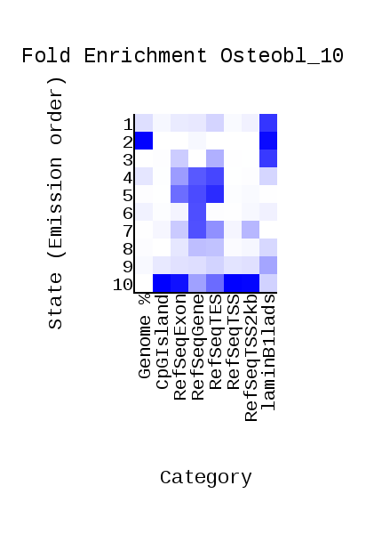
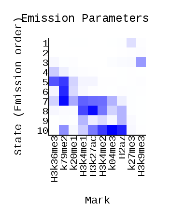
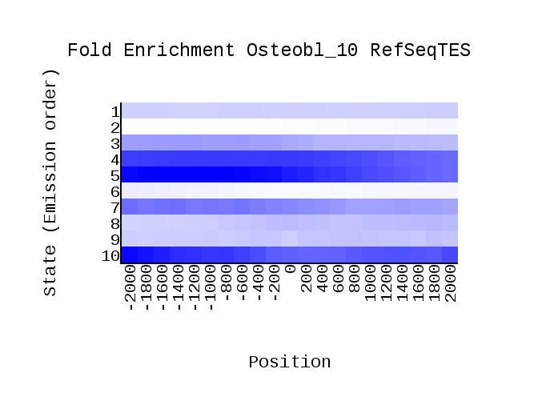
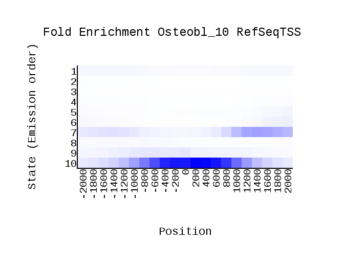
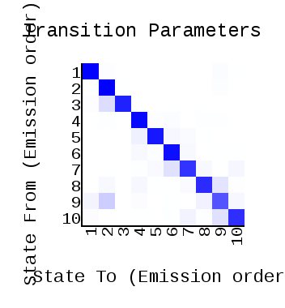
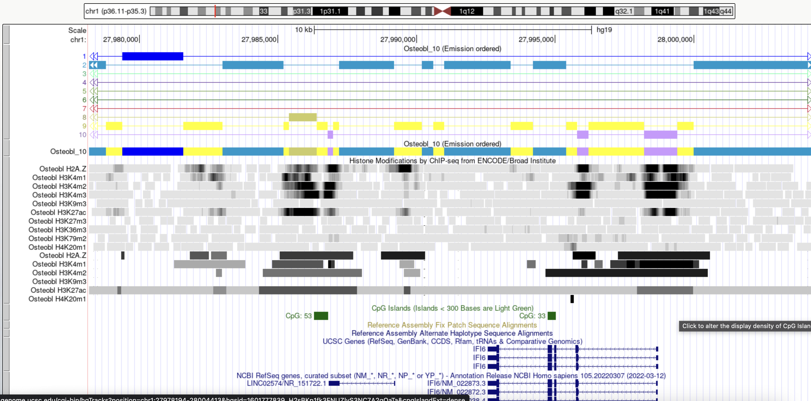
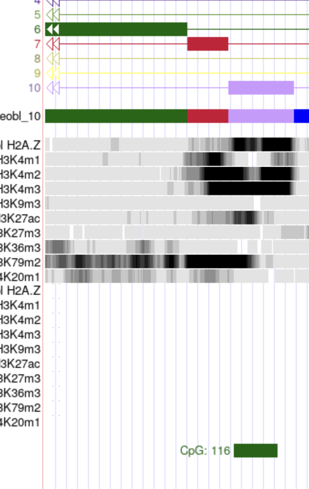
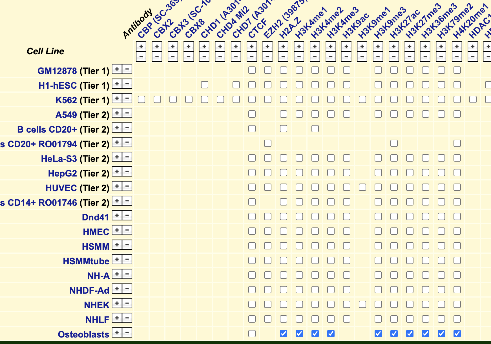
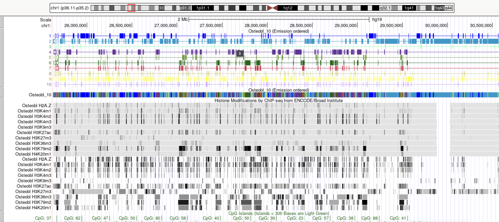

# hse_hw3_chromhmm
Домашнее задание №3 (ChromHMM)

Клеточная линия: Osteobl (пришлось взять другую, т.к. нет нужных гистоновых модификаций для предыдущей клеточной линии)

- Список 10-ти гистоновых меток (и соотв имен файлов) , для которых был сделан анализ

| Гистоновых метка     | Файл           |
|----------------------|----------------|
| H2az                 | H2az.bam       |
| H3k27ac              | H3k27ac.bam    |
| k27me3               | k27me3.bam     |
| H3k36me3             | H3k36me3.bam   |
| H3k4me1              | H3k4me1.bam    |
| H3k4me2              | H3k4me2.bam    |
| k04me3               | k04me3.bam     |
| k79me2               | k79me2.bam     |
| H3k9me3              | H3k9me3.bam    |
| k20me1               | k20me1.bam     |

- [cellmarkfiletable.txt](https://github.com/dreamer1978/hse_hw3_chromhmm/blob/main/cellmarkfiletable.txt)

| Cell_Type | Histone_Modification | File_Expiriment| File_Control           |
|-----------|----------------------|----------------|------------------------|
| Osteobl   | H2az                 | H2az.bam       | ControlStdAlnRep1.bam  |
| Osteobl   | H3k27ac              | H3k27ac.bam    | ControlStdAlnRep1.bam  |
| Osteobl   | k27me3               | k27me3.bam     | ControlStdAlnRep1.bam  |
| Osteobl   | H3k36me3             | H3k36me3.bam   | ControlStdAlnRep1.bam  |
| Osteobl   | H3k4me1              | H3k4me1.bam    | ControlStdAlnRep1.bam  |
| Osteobl   | H3k4me2              | H3k4me2.bam    | ControlStdAlnRep1.bam  |
| Osteobl   | k04me3               | k04me3.bam     | ControlStdAlnRep1.bam  |
| Osteobl   | k79me2               | k79me2.bam     | ControlStdAlnRep1.bam  |
| Osteobl   | H3k9me3              | H3k9me3.bam    | ControlStdAlnRep1.bam  |
| Osteobl   | k20me1               | k20me1.bam     | ControlStdAlnRep1.bam  |

- [collab](https://colab.research.google.com/drive/1RRmLmctNgsXx4Te7RhVgopuA45RzQnop?usp=sharing)
- [Папка с выдачей ChromHMM](https://github.com/dreamer1978/hse_hw3_chromhmm/tree/main/Output)
- Картинки из выдачи ChromHMM

- Табличка с номерами эпигенетических типов, их характерные эпигенетические метки и другие свойства, а также присвоенные им названия

| Номера типов   | Характерные гистоновые метки                       | Название           |
|----------------|----------------------------------------------------|--------------------|
|1               | k27me3                                             | Heterochromatin    |
|2               |                                                    | Heterochromatin    |
|3               | H3k9me3                                            | Heterochromatin    |
|4               | H3k36me3                                           | Transcribed        |
|5               | H3k36me3, k79me2                                   | Transcribed        |
|6               | k79me2, k20me1                                     | Transcribed        |
|7               | k79me2, k04me3, H3k36me3, H3k4me1, H3k4me2         | Active Promoter    |
|8               | H2az, k04me3, H3k36me3, H3k4me1, H3k4me2           | Heterochromatin    |
|9               | H2az, H3k36me3, H3k4me1, H3k4me2                   | Active Promoter    |
|10              | H2az, k04me3, H3k36me3, H3k4me1, H3k4me2, k79me2   | Active Promoter    |

- 1 тип

Слабый сигнал, поэтому Heterochromatin.

- 2 тип

Распологается больше всех в геноме и ламине.

- 3 тип

Попадает на ламину и в целом сигнал слабый, поэтому Heterochromatin.

- 4 тип

Сильная ассоциация с SeqGene и TES. Редко встречается на геноме.

- 5 тип

Сильная ассоциация с SeqGene, TES и TSS. Редко встречается на геноме.

- 6 тип

Сильная ассоциация с SeqGene, попадает на интроны

- 7 тип

Редко встречается в геноме, сильный сигнал для RefSeq, ассоциация с TES

- 8 тип

В целом слабый сигнал везде.

- 9 тип

Немного попадает на CPG островки. Попадает на экзон и интрон. Поэтому Active Promoter.

- 10 тип

Распологается в зоне CPG островков. Попадает на экзон и интрон. Поэтому Active Promoter.

- Еще картиночки из геномного браузера.

# Бонус
